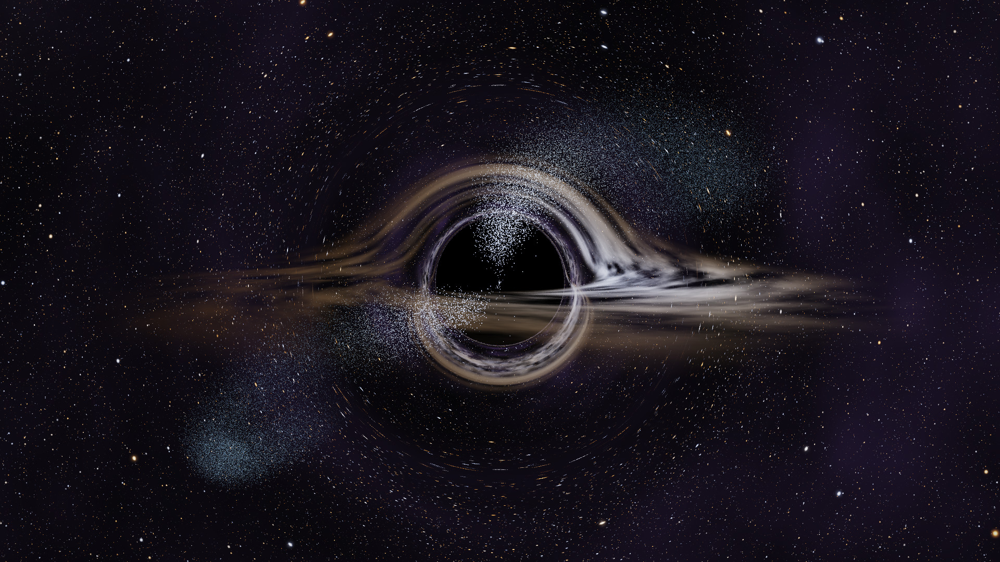

# Black Hole Wallpaper



Ray-marched Schwarzschild black hole as a live desktop wallpaper: gravitational
lensing, relativistic accretion disk (Doppler beaming + gravitational redshift),
procedural star field, and cursor-fed particles that spiral into the horizon.
Native C++17 with three GPU paths:

| Path | What it does |
|------|--------------|
| **OpenGL 4.6 compute** | default backend: `blackhole.comp` ray marcher, bloom, particle points, composite |
| **Vulkan 1.1** | same pipeline from the same GLSL (pre-compiled SPIR-V), swapchain or headless |
| **CUDA + interop** | particle simulation kernel writing straight into the GL SSBO (`cudaGraphicsGLRegisterBuffer`) or the Vulkan buffer (`VK_KHR_external_memory` + external semaphores). Falls back to a GLSL compute shader when CUDA is absent. |

Built for [Lively Wallpaper](https://github.com/rocksdanister/lively); the project
layout mirrors [rocksdanister/rain](https://github.com/rocksdanister/rain):

```
rain (web)                     blackhole_render (native)
-----------------------------  ------------------------------------------------
index.html                     src/main.cpp                (entry, args)
js/script.js                   src/app/Application.cpp    (init / resize / render loop,
                                                            livelyPropertyListener,
                                                            livelyWallpaperPlaybackChanged)
  datUI()                      src/app/DebugUI.cpp        (Dear ImGui tuning panel)
  livelyPropertyListener       src/app/Settings.cpp       (LivelyProperties.json binding, hot reload)
  parallax / mousemove         src/platform/Input.cpp     (window + global cursor tracking)
                               src/app/LivelyIpc.cpp      (Lively stdin/stdout JSON protocol)
shaders/rain.frag              shaders/*.comp|vert|frag   (GLSL shared by GL and Vulkan)
                               shaders/common/*.glsl      (geodesic, disk, sky, noise, params)
                               shaders/spv/*.spv          (SPIR-V for the Vulkan backend)
three.min.js                   src/render/gl/*, src/render/vk/*, src/render/cuda/*
LivelyInfo.json                LivelyInfo.json            (Type 0 = application wallpaper)
LivelyProperties.json          LivelyProperties.json      (all tunables; hot-reloaded)
assets/, media/                assets/, media/
```

## Features

- **Physics** - null geodesics integrated in Schwarzschild spacetime
  (`d²x/dλ² = -3/2 · rs · h² · x / r⁵`, velocity-Verlet with adaptive step), thin
  Keplerian disk between the ISCO (3 rs) and a configurable outer radius,
  Shakura-Sunyaev temperature profile, blackbody colours, Doppler factor
  `1/(γ(1-β·n))`, gravitational redshift `√(1-rs/r)`, multiple disk images and
  the photon ring emerge naturally from the integration.
- **Sky** - three hashed star layers with blackbody colours plus an fbm Milky-Way band.
- **Scalable load** - cost is `pixels × samples × steps`. `displayScaling` (up to 4×),
  `samples` (1-64 jittered sub-samples per pixel) and `maxSteps` (32-4096) let you turn
  a 60 fps wallpaper into a 100 % GPU burner. Optional temporal accumulation.
- **Cursor particles** - moving the mouse spawns particles at the cursor (projected onto
  the lens plane) with Keplerian tangential velocity; a Paczyński-Wiita pseudo-Newtonian
  potential pulls them in, they heat up (blue → white → orange) and vanish at the
  horizon. Apparent positions get a cheap lensing deflection (`α ≈ 2rs/b`). Pool size up
  to millions; simulated by CUDA or GLSL compute.
- **Post** - half-resolution bloom, ACES tonemap, mouse parallax on the orbit camera.
- **Wallpaper integration** - Lively `Type 0` app wallpaper (`--lively`), self-embedding
  behind desktop icons without Lively (`--wallpaper`: layered child of Progman presented via
  DirectComposition on Windows 11, WorkerW child on older Windows, desktop-type window on X11), Lively player IPC on stdin (`{"Type":12,"Name":"samples","Value":8}`),
  `LivelyProperties.json` hot reload, screenshot command, headless rendering for CI/previews.

## Build

Windows (TITAN X target): see [docs/WINDOWS_BUILD.md](docs/WINDOWS_BUILD.md). Short version:

```powershell
cmake --preset windows-msvc && cmake --build --preset windows-msvc
build-win\Release\blackhole_render.exe --debug
```

Linux (development / headless verification):

```bash
# deps: glfw3, glm, nlohmann-json, Vulkan headers, X11 headers, optional glslc + CUDA 12.x
#   (conda: conda create -n bh -c conda-forge glfw vulkan-headers shaderc glm nlohmann_json xorg-libx11)
cmake -B build -DCMAKE_BUILD_TYPE=Release [-DCMAKE_PREFIX_PATH=$CONDA_PREFIX]
cmake --build build -j
./build/blackhole_render --headless --frames 120 --sim-cursor --out preview.png
```

CMake options: `BH_ENABLE_VULKAN`, `BH_ENABLE_CUDA`, `BH_ENABLE_IMGUI`,
`BH_ENABLE_HEADLESS`, `BH_FETCH_DEPS` (FetchContent for missing deps), `BH_COMPILE_SPIRV`.

## Run

```
blackhole_render [--windowed|--fullscreen|--wallpaper|--lively|--headless]
                 [--backend gl|vk] [--particles auto|cuda|compute]
                 [--width W --height H] [--scale F] [--samples N] [--steps N]
                 [--frames N --out file.png --dt 0.0166]   (headless)
                 [--properties path] [--set name=value ...] [--ipc] [--debug]
                 [--sim-cursor] [--global-mouse 0|1] [--gpu N] [--vsync] [--validation]
```

Examples:

```bash
blackhole_render --debug                          # tuning window (rain's datUI)
blackhole_render --wallpaper                      # live wallpaper without Lively
blackhole_render --backend vk --particles cuda    # Vulkan + CUDA interop
blackhole_render --headless --scale 2 --samples 16 --steps 800 --frames 30 --out 4k.png
```

## Tuning

Every knob lives in `LivelyProperties.json` (Lively-style sliders/dropdowns/checkboxes).
The running app reloads the file when it changes; the `--debug` panel edits the same
values live and can write them back. Highlights:

| Group | Keys |
|-------|------|
| Performance | `displayScaling`, `samples`, `maxSteps`, `stepSize`, `fpsLock`, `temporalBlend`, `bloomChk` |
| Disk | `diskBrightness`, `diskTemperature`, `diskInner`, `diskOuter`, `diskSpeed`, `diskOpacity`, `diskRotation`, `diskNoiseScale`, `dopplerStrength`, `redshiftStrength` |
| Sky | `starDensity`, `starBrightness`, `nebulaBrightness` |
| Camera | `cameraDistance`, `cameraInclination`, `cameraOrbitSpeed`, `fov`, `parallaxIntensity`, `parallaxDamp` |
| Post | `exposure`, `bloomStrength`, `bloomThreshold` |
| Particles | `particlesChk`, `particleCount`, `particleEmitRate`, `particleSpeed`, `particleSize`, `particleBrightness`, `particleLife`, `particleSpawnRadius`, `particleOrbitBias`, `particleDrag`, `particleSpread`, `mouseIdleTimeout`, `lensStrength` |
| Misc | `renderBackend`, `particleBackend` (restart), `globalMouse`, `debug` |

## Lively IPC

Lively's own message classes are supported on stdin (`Type` = `MessageType` enum index or
name): `lp_slider`(12), `lp_dropdown`(14), `lp_chekbox`(18), `cmd_close`(5),
`cmd_screenshot`(6, `FilePath`), `cmd_suspend`(7), `cmd_resume`(8), `cmd_reload`(4) and
`lively:terminate`. The app answers with `msg_hwnd`(0), `msg_wploaded`(2),
`msg_screenshot`(3) and `msg_console`(1) lines on stdout.

## Source map

```
src/app        Application, Settings, LivelyIpc, DebugUI
src/platform   Window (GLFW), Input (cursor), Wallpaper (WorkerW / X11), Clock
src/render     RenderParams (std140 mirror of shaders/common/params.glsl), Camera, IRenderer
src/render/gl  GLLoader (function pointers), GLShader (#include preprocessor), EglContext
               (headless), GLParticles (SSBO + CUDA/GLSL sim), GLRenderer
src/render/vk  VkContext (volk, device, swapchain, external memory), VkParticles, VkRenderer
src/render/cuda CudaParticles.cu (kernel), CudaInterop (GL register / VK import, semaphores)
```

## License

MIT - see `License.txt`. Third-party: GLFW, glm, nlohmann/json, volk, Dear ImGui,
stb_image_write, Khronos headers.
